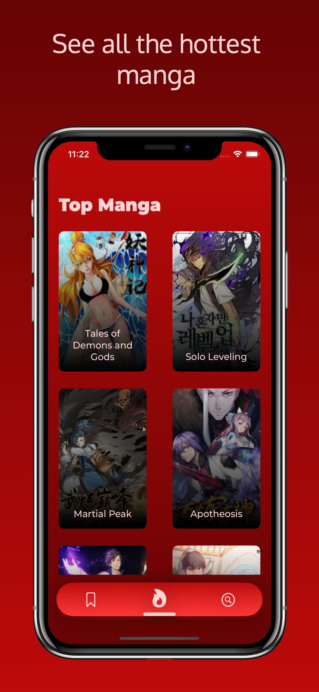
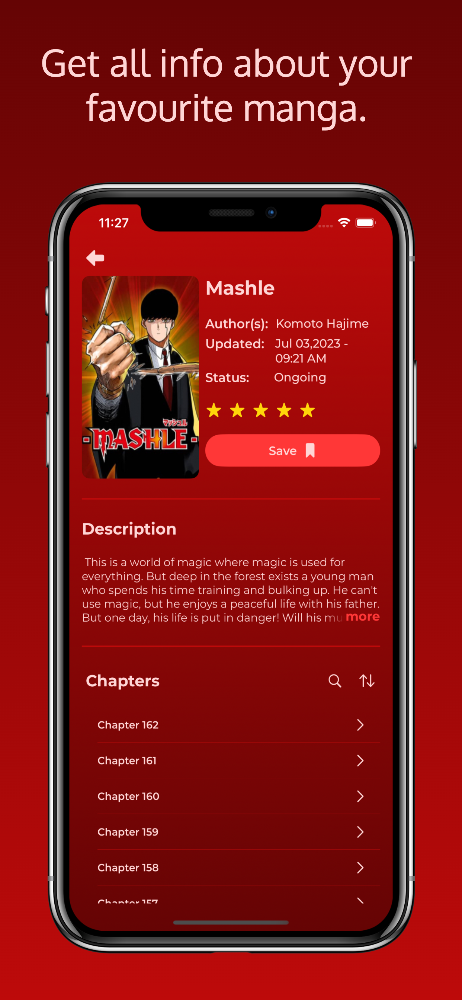

# MangaMania
A free app made using SwiftUI for users who wish to read any manga of their choosing. The architecture followed is MVVM. The app is also integrated with Firebase RemoteConfig and Firebase Push Notification.

